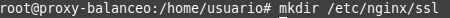
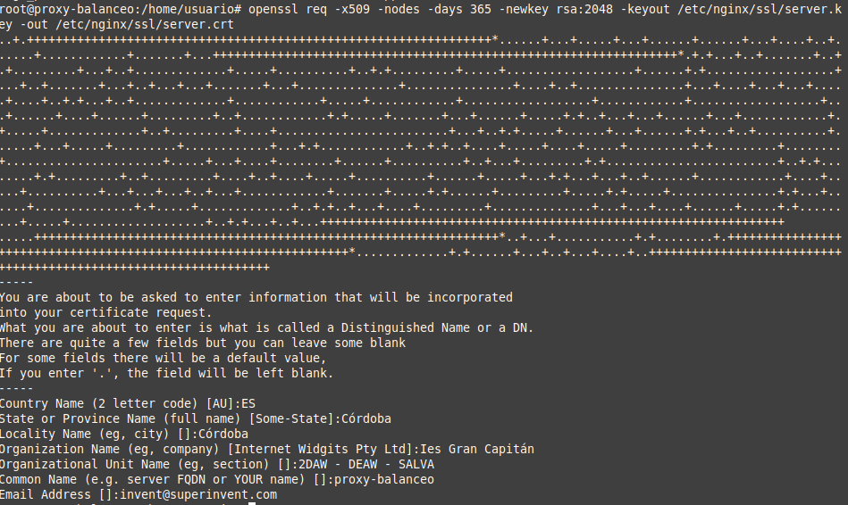
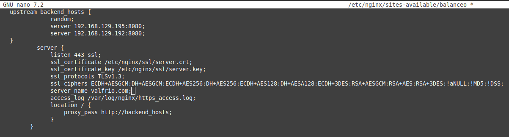
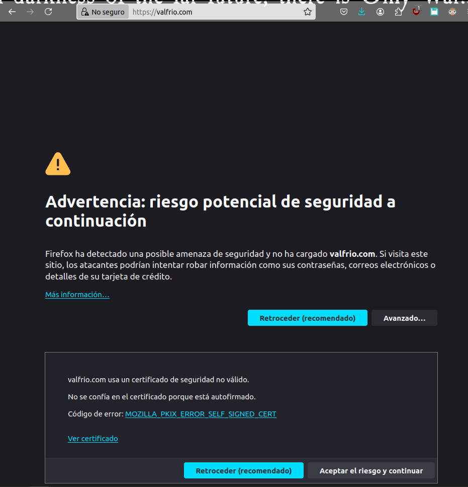
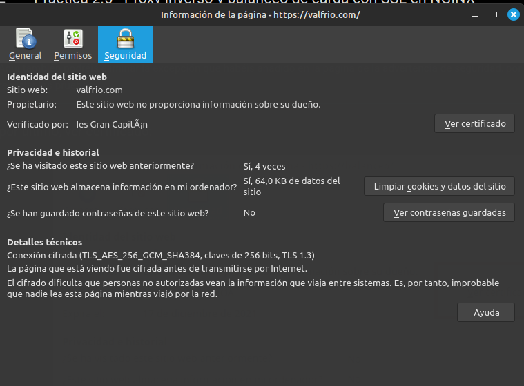
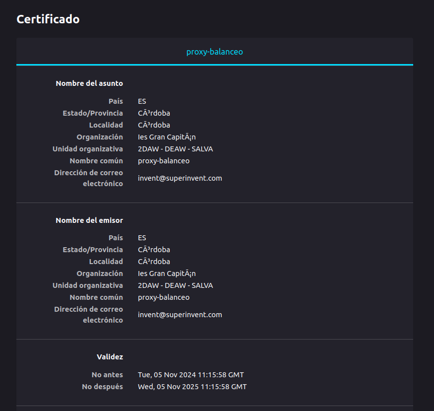
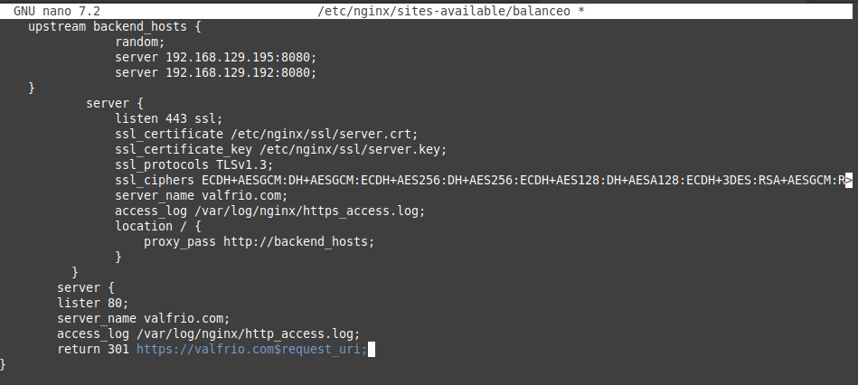
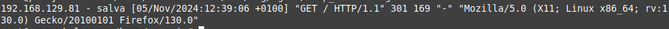
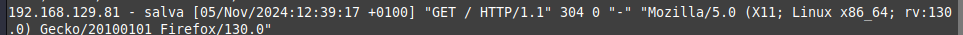
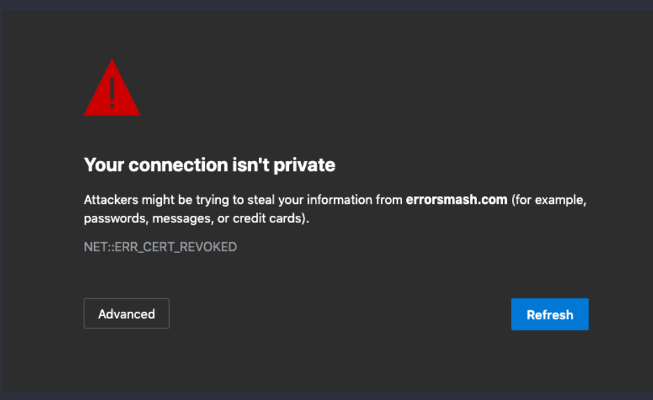

#  Practica 2.5 - Proxy inverso y balanceo de carga con SSL en NGINX 

Para comenzar las ip de mis máquinas han sido:

- ip webserver1 192.168.129.195
- ip proxy 192.168.129.60
- ip webserver2 192.168.129.192

## Creación de certificado autofirmado

Dado que nuestra web no está publicada en internet y los certificados son de pago vamos a emitir y firmar nosotros el certificado de nuestra web.

Para comenzar debemos de crear la carpeta que va a contener los certificados que vamos a generar.



Ahora debemos de crear el certificado autofirmado y una clave privada para firmar el certificado. Para ello ejecutamos el siguiente comando:



En el comando podemos ver distintas partes:

- **openssl**: Es el comando que vamos a utilizar para generar el certificado.
- **req**: Indica que vamos a realizar una petición de certificado.
- **-x509**: Indica que vamos a crear un certificado autofirmado.
- **-nodes**: Indica que no vamos a cifrar la clave privada. De esta forma el servidor podrá leer el contenido de la clave privada sin necesidad de introducir una contraseña.
- **-days 365**: Indica que el certificado va a durar 365 días.
- **-newkey rsa:2048**: Indica que vamos a generar una clave privada RSA de 2048 bits.
- **-keyout**:  indica donde vamos a guardar la clave privada.
- **-out**: indica donde vamos a guardar el certificado.

Tendrémos a su vez que rellenar los datos que nos pide el comando como puede verse en la imagen.

## Configuración SSL en el proxy inverso

Ahora debemos de configurar el proxy inverso para que pueda trabajar con SSL. Para ello debemos de modificar el archivo de configuración de nginx que se encuentra en la ruta `/etc/nginx/sites-available/`.

Para ello debemos de cambiar el puerto de escucha del servidor web a 443 y añadir las rutas del certificado que hemos creado anteriormente, así como la clave privada, el protocolo y los cifrados que vamos a aceptar. 

Una vez hecho el archivo de configuración debe de quedar así:



Ahora solo queda reiniciar el servicio de nginx para que los cambios surtan efecto, dado que el enlace simbólico ya está creado.

## Comprobaciones

Podemos ver que si nos conectamos por https nos saltará un error de certificado, esto es debido a que el certificado no es de confianza, ya que no está firmado por una entidad certificadora de confianza. 



Si aceptamos el riesgo y continuamos podemos ver que la web se muestra correctamente. Ahora si inspeccionamos en la barra de navegación podemos ver que la conexión es segura. Si clickamos en el candado podemos ver la información del certificado. 



Ahora si le damos ver certificado podemos ver la información del certificado que hemos creado.




## Redirección forzosa a HTTPS

Para forzar la redirección a HTTPS debemos de modificar el archivo de configuración de nginx que se encuentra en la ruta `/etc/nginx/sites-available/` y añadir un bloque de configuración que redirija todas las peticiones que lleguen por el puerto 80 a la misma dirección pero por el puerto 443.

El archivo de configuración debe de quedar así:



El apartado de access_log nos guardará información de las peticiones que lleguen por el puerto 80 y el return 301 mandará la cabecera de redirección a la dirección que le indiquemos. 

Podemos ver aquí los logs de acceso que se han generado:



y el de https:



## Cuestiones finales

### Cuestión 1

Hemos configurado nuestro proxy inverso con todo lo que nos hace falta pero no nos funciona y da un error del tipo This site can't provide a secure connection, ERR_SSL_PROTOCOL_ERROR.

Dentro de nuestro server block tenemos esto:

```nginx
server {
    listen 443;
    ssl_certificate /etc/nginx/ssl/enrico-berlinguer/server.crt;
    ssl_certificate_key /etc/nginx/ssl/enrico-berlinguer/server.key;
    ssl_protocols TLSv1.3;
    ssl_ciphers ECDH+AESGCM:DH+AESGCM:ECDH+AES256:DH+AES256:ECDH+AES128:DH+AES:ECDH+3DES:DH+3DES:RSA+AESGCM:RSA+AES:RSA+3DES:!aNULL:!MD5:!DSS;
    server_name enrico-berlinguer;
    access_log /var/log/nginx/https_access.log;

    location / {
        proxy_pass http://red-party;
        }
    }

```
#### Respuesta
Falta el ssl en listen 443, de manera que no especifica que es una conexión segura. 


### Cuestión 2

Imaginad que intentamos acceder a nuestro sitio web HTTPS y nos encontramos con el siguiente error:



Investigad qué está pasando y como se ha de solucionar.

#### Respuesta

EL error se debe a que el certificado creado no está firmado por una entidad de confianza, por lo que el navegador no lo reconoce como seguro. 

Para solucionar este problema debemos de comprar un certificado a una entidad certificadora de confianza o añadir una excepción en el navegador para que confíe en nuestro certificado.